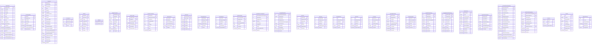

```mermaid
erDiagram

    NguoiDungs {
        int MaNguoiDung PK
        varchar TaiKhoan
        varchar MatKhau
        varchar GoogleID
        varchar HoTen
        varchar Email
        varchar AnhDaiDien
        int VaiTro
        varchar TrangThai
        timestamp NgayThamGia
        text LyDoKhoa
        timestamp ThoiGianMoKhoa
        timestamp NgayDangNhapCuoi
        varchar MaOTP
        timestamp ThoiGianHetHanOTP
        varchar MaNganHangNhanTien
        varchar SoTaiKhoanNhanTien
        varchar TenTaiKhoanNhanTien
    }

    PhienDangNhap {
        int MaPhien PK
        int MaNguoiDung FK
        varchar MaThietBi
        varchar TenThietBi
        varchar DiaChiIP
        timestamp ThoiGianDangNhap
        timestamp ThoiGianHoatDongCuoi
        bool DangHoatDong
    }

    KhoaHocs {
        int MaKhoaHoc PK
        int MaGiangVien FK
        varchar TenKhoaHoc
        text MoTa
        varchar HinhAnh
        varchar TrangThai
        double DiemDanhGiaTB
        varchar LinhVuc
        varchar TrinhDo
        int ThoiLuongGio
        varchar KyNangChinh
        bool CoChungChi
        varchar TenChungChi
        double DiemDatChungChi
        int SoCauHoiChungChi
        int ThoiGianLamBaiChungChi
        text DuLieuDeChungChiJSON
        varchar NguonDeChungChi
        timestamp NgayTaoDeChungChi
        numeric GiaKhoaHoc
        varchar DonViTienTe
        bool ChoPhepMua
        timestamp NgayTao
    }

    ChuongHocs {
        int MaChuong PK
        int MaKhoaHoc FK
        varchar TenChuong
        int ThuTu
    }

    BaiHocs {
        int MaBaiHoc PK
        int MaChuong FK
        varchar TieuDe
        varchar LoaiBaiHoc
        text NoiDung
        int ThoiLuong
        varchar LinkVideo
        int ThuTu
        bool CoQuiz
    }

    BaiTaps {
        int MaBaiTap PK
        int MaBaiHoc FK
    }

    BaiTapThucHanhs {
        int MaBaiTapTH PK
        int MaBaiTap FK
        varchar TieuDe
        text MoTaDeBai
        varchar NgonNgu
        varchar MucDo
        text LoiGiaiMau
        text GoiY
        timestamp NgayTao
        bool TrangThai
    }

    BaiTap_Quizs {
        int MaBaiTapQuiz PK
        int MaBaiTap FK
        int ThoiGianLamBai
        double DiemCanDat
        bool ChoPhepLamLai
        bool DaoCauHoi
        text DuLieuCauHoi
    }

    TestCaseThucHanhs {
        int MaTestCase PK
        int MaBaiTapThucHanh FK
        text InputDuLieu
        text OutputMongDoi
        text MoTa
        bool LaTestAn
        int ThuTu
        int Diem
        timestamp NgayTao
    }

    VideoChapters {
        int MaChapter PK
        int MaBaiHoc FK
        int ThoiGianBatDau
        int ThoiGianKetThuc
        varchar KienThucChinh
        bool BatBuoc
    }

    VideoQuizs {
        int MaVideoQuiz PK
        int MaChapter FK
        varchar CauHoi
        varchar DapAnA
        varchar DapAnB
        varchar DapAnC
        varchar DapAnD
        varchar DapAnDung
    }

    DangKyKhoaHocs {
        int MaDangKy PK
        int MaNguoiDung FK
        int MaKhoaHoc FK
        timestamp NgayDangKy
        varchar TrangThai
        int TienDo
    }

    TienDoBaiHocs {
        int MaTienDo PK
        int MaNguoiDung FK
        int MaBaiHoc FK
        bool DaXem
        int ThoiGianHoc
        timestamp NgayCapNhat
    }

    KetQuaLamBais {
        int MaKetQuaBaiNop PK
        int MaNguoiDung FK
        int MaBaiTap FK
        text NoiDungNopJSON
        float DiemSo
        bool TrangThai
        timestamp NgayNop
    }

    KetQuaKiemTraChungChis {
        int MaKetQuaKiemTraChungChi PK
        int MaKhoaHoc FK
        int MaNguoiDung FK
        double DiemSo
        int SoCauDung
        int TongSoCau
        bool DaDat
        text ChiTietLamBaiJSON
        timestamp NgayThi
    }

    ChungChiKhoaHocs {
        int MaChungChiKhoaHoc PK
        varchar MaChungChi
        int MaKhoaHoc FK
        int MaNguoiDung FK
        int MaKetQuaKiemTraChungChi FK
        varchar HoTenHienThi
        varchar EmailNhan
        bool DaGuiEmail
        timestamp NgayGuiEmail
        timestamp NgayCap
    }

    DanhGias {
        int MaDanhGia PK
        int MaNguoiDung FK
        int MaKhoaHoc FK
        int SoSao
        varchar NhanXet
        timestamp NgayDanhGia
        varchar TrangThai
    }

    BinhLuans {
        int MaBinhLuan PK
        int MaNguoiDung FK
        int MaBaiHoc FK
        text NoiDung
        int MaBinhLuanCha FK
        timestamp NgayTao
    }

    GhiChuBaiHocs {
        int Id PK
        int MaNguoiDung FK
        int MaBaiHoc FK
        int ThoiGianVideo
        varchar NoiDung
        timestamp NgayTao
    }

    GhiChuAIs {
        int Id PK
        int MaNguoiDung FK
        int MaBaiHoc FK
        text NoiDung
        timestamp NgayTao
        timestamp NgayCapNhat
    }

    LoTrinhAIs {
        int MaLoTrinh PK
        int MaNguoiDung FK
        text YeuCau
        text NoiDungJSON
        varchar TrangThai
        timestamp NgayTao
    }

    DonHangKhoaHocs {
        int MaDonHang PK
        int MaNguoiDung FK
        numeric TongTien
        varchar LoaiTien
        varchar TrangThaiDonHang
        varchar IdempotencyKey
        timestamp CreatedAt
        timestamp UpdatedAt
        timestamp ExpiredAt
    }

    ChiTietDonHangs {
        int MaChiTiet PK
        int MaDonHang FK
        int MaKhoaHoc FK
        numeric DonGia
        numeric GiamGia
        numeric ThanhTien
    }

    GiaoDichThanhToans {
        int MaGiaoDich PK
        int MaDonHang FK
        varchar CongThanhToan
        varchar MaThamChieuNgoai
        numeric SoTien
        varchar TrangThai
        jsonb RawWebhook
        timestamp PaidAt
        timestamp CreatedAt
        timestamp UpdatedAt
    }

    ThongBaoEmailThanhToans {
        int MaThongBao PK
        int MaDonHang FK
        varchar LoaiThongBao
        varchar EmailNhan
        varchar TrangThai
        int SoLanThu
        varchar LoiCuoi
        timestamp SentAt
        timestamp CreatedAt
        timestamp UpdatedAt
    }

    MaGiamGias {
        int MaVoucher PK
        varchar Code
        varchar TenChuongTrinh
        varchar LoaiGiamGia
        numeric GiaTriGiam
        numeric GiamToiDa
        numeric DonHangToiThieu
        int SoLuongToiDa
        int SoLuongDaDung
        bool KichHoat
        timestamp BatDauAt
        timestamp KetThucAt
    }

    DoanhThuGiangViens {
        int MaDoanhThu PK
        int MaGiangVien FK
        int MaDonHang FK
        numeric TongTienDonHang
        numeric PhiNenTang
        numeric ThucNhanGiangVien
        varchar TrangThaiDoiSoat
        timestamp CreatedAt
    }

    YeuCauRutTienGiangViens {
        int MaYeuCauRutTien PK
        int MaGiangVien FK
        numeric SoTienYeuCau
        varchar TrangThaiYeuCau
        varchar LoaiTien
        varchar MaNganHangNhan
        varchar SoTaiKhoanNhan
        varchar TenTaiKhoanNhan
        varchar NoiDungChuyenKhoan
        varchar DuongDanAnhQr
        numeric SoTienDaChuyen
        long MaGiaoDichSePay
        timestamp CreatedAt
        timestamp DuyetLuc
        int MaQuanTriVienDuyet FK
        timestamp ChuyenKhoanThanhCongLuc
        timestamp GuiEmailRutTienThanhCongLuc
        varchar GhiChuAdmin
    }

    HoTroRutTienGiangViens {
        int MaHoTroRutTienGiangVien PK
        int MaYeuCauRutTien FK
        int MaGiangVien FK
        varchar TrangThaiHoTro
        varchar ThongTinLienLac
        varchar NoiDungGiangVien
        varchar GhiChuAdmin
        int MaQuanTriVienXuLy FK
        timestamp CreatedAt
        timestamp UpdatedAt
        timestamp XuLyLuc
    }

    CauHinhs {
        varchar MaKhoa PK
        text GiaTri
        varchar MoTa
        timestamp NgayCapNhat
    }

    KeyAPIs {
        int ID PK
        varchar TenKey
        text MaKeyMaHoa
        varchar LoaiKey
        bool TrangThai
        int ThuTuUuTien
        int HanMucRequest
        int HanMucToken
        timestamp NgayTao
    }

    NhatKySuDungs {
        long ID PK
        int ID_Key FK
        int SoTokenTieuHao
        timestamp ThoiGianGoi
        int MaTrangThai
        varchar DuongDanAPI
    }
```
