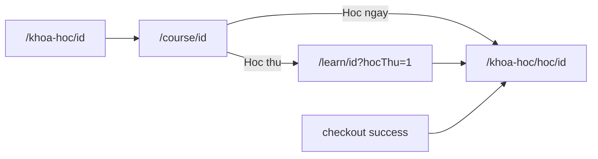
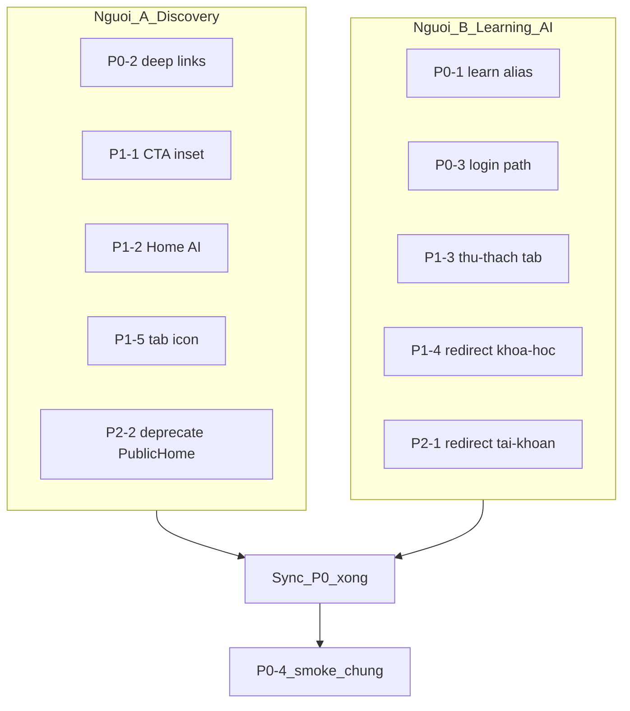

# Kế hoạch sửa giao diện / điều hướng Mobile (Khiến)

> Nguồn: kế hoạch Cursor `mobile_ui_fix_plan`. **Trạng thái: code A+B đã làm xong** (2026-08-26); còn smoke test tay trên máy.  
> **Chia 2 người** — đã triển khai cả A và B trong `educodeai-mobile/`.

## Phạm vi đợt này
**P0 + P1** (lỗi nghiêm trọng + layout/UX chính). P2 dọn nhẹ làm sau P0/P1.

**Ranh giới repo (bắt buộc):**
- Chỉ sửa code trong folder `educodeai-mobile/`.
- **Không** đụng `educodeai-client/`, `educodeai-server/`, `educodeai-server.Tests/`, worker, hay folder app khác.
- File kế hoạch này nằm ở `docs/` chỉ để theo dõi task — không phải thay đổi nghiệp vụ backend/web.

**Quyết định kỹ thuật đã chốt (cả 2 người phải tuân thủ):**
- Player thật: `/khoa-hoc/hoc/[courseId]`
- Alias: `/learn/[courseId]` → cùng player
- Chi tiết khóa canonical: `/course/[courseId]`; legacy `/khoa-hoc/[courseId]` redirect sang canonical
- Login: `/(auth)/login` (không dùng `/auth/login`)

---

## Phân công 2 người

| Vai | Phụ trách | Gợi ý người |
|---|---|---|
| **A — Discovery & Commerce** | Deep-link từ Home/Detail/Checkout, CTA layout, tab icon, deprecate PublicHome | **Khiến** |
| **B — Learning / AI / Auth routes** | Alias `/learn`, login path player, tab Thử thách, redirect `/khoa-hoc` & `/tai-khoan` | **Khôi** (hoặc người phụ Learning/AI) |

**Quy tắc tránh conflict git:**
- A **không** sửa: `CoursePlayerScreen`, `thu-thach.screen`, `app/learn/`, `app/khoa-hoc/[courseId].tsx`, `app/tai-khoan.tsx`
- B **không** sửa: `checkout.screen`, `course-detail.screen`, `home.screen`, `(tabs)/_layout` (trừ khi A nhờ review), `discovery/index.ts`
- File chung chỉ được đụng ở **điểm sync** (xem dưới)

---

## Checklist — Người A (Discovery & Commerce)

### P0
- [x] **A / P0-2** Sửa deep-link Discovery → Learning
  - `checkout.screen.tsx`: sau thanh toán → `/khoa-hoc/hoc/${id}` (path chính)
  - `course-detail.screen.tsx`: `goHocThu` → `/khoa-hoc/hoc/${id}?hocThu=1` (khớp `goLearn`)
  - `discovery/index.ts`: cập nhật comment contract (`/learn` = alias, path chính = `/khoa-hoc/hoc/...`)

### P1
- [x] **A / P1-1** Safe area CTA — `course-detail.screen.tsx` + `useSafeAreaInsets()`
- [x] **A / P1-2** Wire card AI Home → `/lo-trinh-ai`, `/sinh-do-an-ai`, `/phong-van-ai`
- [x] **A / P1-5** Icon tab Khóa học — `(tabs)/_layout.tsx`: `search-outline` → `book-outline`

### P2 (sau P0/P1)
- [x] **A / P2-2** Comment `@deprecated` trên `PublicHomeScreen.tsx` (không xóa file)

**File A được sửa:**
- `educodeai-mobile/src/features/discovery/screens/checkout.screen.tsx`
- `educodeai-mobile/src/features/discovery/screens/course-detail.screen.tsx`
- `educodeai-mobile/src/features/discovery/screens/home.screen.tsx`
- `educodeai-mobile/src/features/discovery/index.ts`
- `educodeai-mobile/src/app/(tabs)/_layout.tsx`
- `educodeai-mobile/src/features/discovery/screens/PublicHomeScreen.tsx` (chỉ comment)

---

## Checklist — Người B (Learning / AI / Auth routes)

### P0
- [x] **B / P0-1** Tạo `educodeai-mobile/src/app/learn/[courseId].tsx` re-export `CoursePlayerScreen` (giống `khoa-hoc/hoc/[courseId].tsx`), giữ query `hocThu`
- [x] **B / P0-3** Đổi `/auth/login` → `/(auth)/login`
  - `CoursePlayerScreen.tsx`
  - `CourseDetailScreen.tsx` (legacy)
  - `PublicHomeScreen.tsx` (nếu còn link login — phối hợp A, hoặc B sửa path login trước khi A gắn deprecated)

### P1
- [x] **B / P1-3** `thu-thach.screen.tsx`: ẩn Back khi trong `(tabs)`; bọc `SafeAreaView`
- [x] **B / P1-4** `app/khoa-hoc/[courseId].tsx`: `Redirect` → `/course/[courseId]`

### P2 (sau P0/P1)
- [x] **B / P2-1** `app/tai-khoan.tsx`: redirect về `/(tabs)/account` (không xóa nếu nhóm Auth còn link)

**File B được sửa:**
- `educodeai-mobile/src/app/learn/[courseId].tsx` (mới)
- `educodeai-mobile/src/features/learning/screens/CoursePlayerScreen.tsx`
- `educodeai-mobile/src/features/discovery/screens/CourseDetailScreen.tsx`
- `educodeai-mobile/src/features/ai-engagement/screens/thu-thach.screen.tsx`
- `educodeai-mobile/src/app/khoa-hoc/[courseId].tsx`
- `educodeai-mobile/src/app/tai-khoan.tsx`
- (tuỳ chọn) path login trong `PublicHomeScreen.tsx` nếu A chưa đụng

---

## Điểm sync & smoke chung

### Sync sau P0 (bắt buộc trước khi merge lớn)
1. B xong **P0-1** (có `/learn`) trước hoặc cùng lúc A xong **P0-2**
2. Cả hai pull/rebase branch chung
3. **P0-4 Smoke chung** (cả 2 cùng test hoặc 1 người verify):
   - [ ] Chi tiết → Học ngay → player (`/khoa-hoc/hoc/...`)
   - [ ] Chi tiết → Học thử → player (`?hocThu=1`)
   - [ ] Checkout success → vào được học
   - [ ] Player chưa login → `/(auth)/login`

### Sync sau P1
- [ ] CTA không đè home indicator
- [ ] Card AI Home mở đúng 3 màn
- [ ] Tab Thử thách không hiện Back sai
- [ ] Vào `/khoa-hoc/{id}` nhảy sang `/course/{id}`
- [ ] `npx tsc --noEmit` trong `educodeai-mobile`

### Branch gợi ý
- A: `khien/mobile-ui-discovery-fix`
- B: `khien/mobile-ui-learning-routes` **hoặc** `khoi/mobile-ui-learning-routes`
- Merge B (P0-1) trước hoặc cùng PR nhỏ, rồi A — tránh A phụ thuộc route chưa có nếu vẫn còn chỗ gọi `/learn`

---

## Không làm trong đợt này
- Đổi contract Auth/Learning backend
- Redesign visual lớn / migrate hết màu AI → tokens (PR riêng sau)
- Fix AI “đang bận” / Redis key
- Commit `.env`
